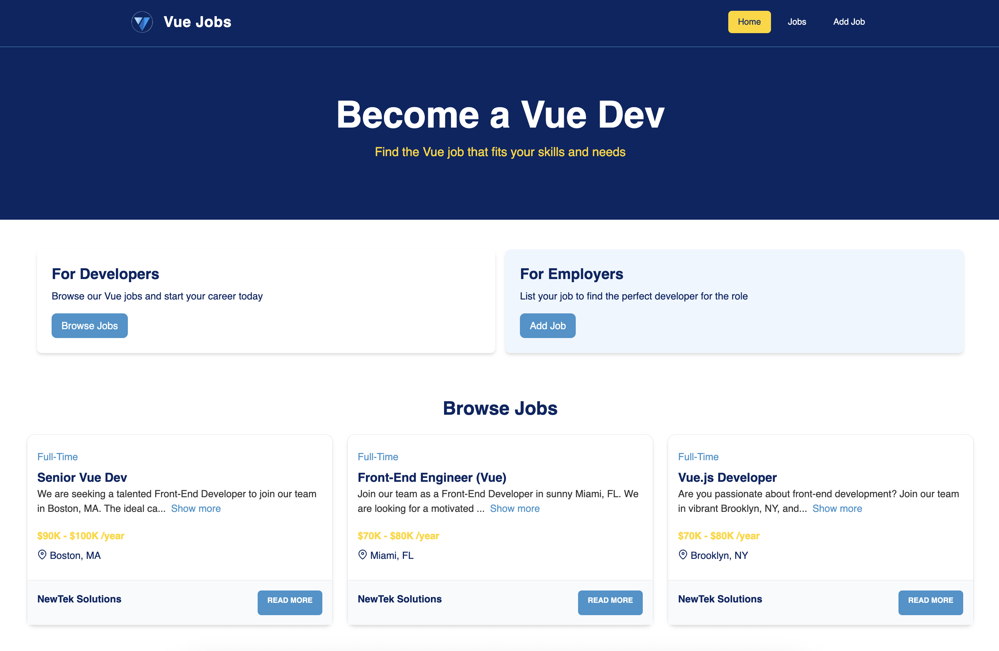

# Hirely 🧑‍💼

Hirely is a simple job portal built with Vue.js to practice CRUD operations. Users can create, read, update, and delete job listings in a clean and interactive interface. This project was created as part of learning Vue.js basics.

## 📸 Screenshot

## ✨ Features

- Create job listings
- View all jobs
- Edit existing jobs
- Delete job listings

## 📦 Getting Started
Follow these steps to run the project locally:

# Clone the repository
`git clone https://github.com/shreyansh-21/Hirely.git`

# Go into the project directory
`cd hirely`

# Install dependencies
`npm install`

# Run the local server
`npm run dev`
